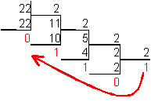

Переводим целое число из десятичной системы в двоичную.

upd: 
Для перевода десятичного числа в двоичную систему его необходимо последовательно делить на 2 до тех пор,
пока не останется остаток, меньший или равный 1.
Число в двоичной системе записывается как последовательность последнего результата деления и остатков от деления в обратном порядке.

Пример:
 
 