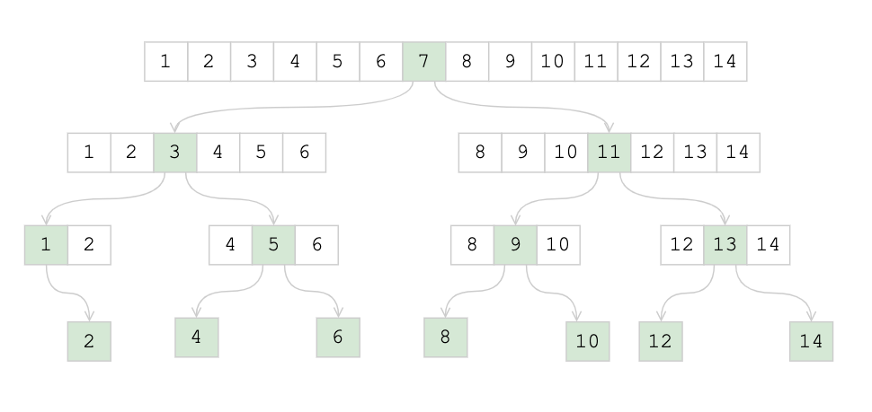

# Bin Search

Преимущество бинарного поиска, быстрый поиск в отсортированном массиве за логорифмическое время 
т.к. объем данных для поиска каждый раз сокращается вдвое.

Существует несколько способов реализации бинарного поиска: 
- Цикл 
- [Рекурсия](bin_search_rotated_arr_rec.py)

Так же искать можно как 
- В отсортированном массиве [1, 2, 3, 4, 5],
- В сдвинутом: [4, 5, 1, 2, 3]. 
- В некоторых случаях возможен поиск по отсортированному массиву с дубликатами, но в этом случае не всегда 
возможно соблюсти O(log(n)).

## Алгоритм

В классической задаче бинарного поиска `x` сравнивается с центральной точкой массива,
что бы узнать, где находится `x` с лева или справа

```python
arr1 = [10, 15, 20, 0, 5]
```

В случа с `rotated array` массив может быть циклически сдвинут и имеет точку перегиба

```python
arr2 = [50, 5, 20, 30, 40]
```


## Пример дерева поиска




