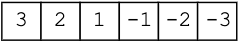
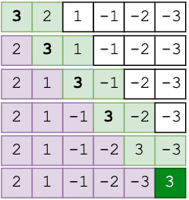
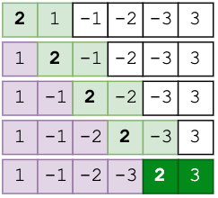
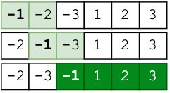
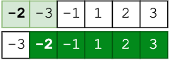
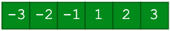

# Bubble Sort

## Алгоритм

На каждом шаге проходим по массиву поочередно сравнивая пары соседних элементов.
Если элемент на позиции i больше элемента на позиции i+1,  меняем их местами.
После первой итерации самый большой элемент окажется в конце списка.

Проходим по каждому элементу массива, до конца, либо пока обмены больше не нужны.

Можно рассмотреть задачу на списке

[Реализация](main.py)

Первым всплывает самый большой элемент 3

Далее всплывает следующий за ним 2

Всплывает 1

Всплывает -1

Последним всплывает -2

Список отсортирован по возрастанию

