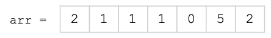
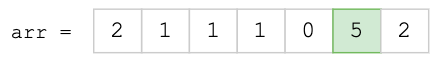
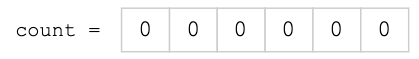
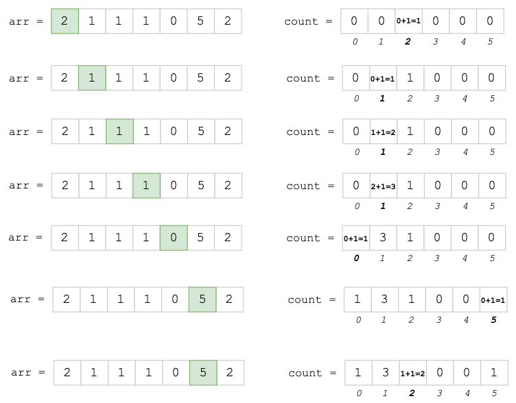
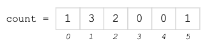
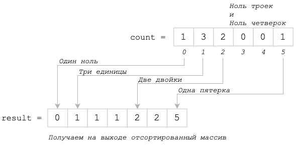

# Поразрядная сортировка

**Основная особенность**: Работает на определенных наборах данных. За линейное время 
сортировать массив положительных целых чисел из не очень большого диапазона, путем подсчета совпадающих элементов.
Требует дополнительную память для счетчиков, но эта память не превышает размер диапазона.

- Асимптотическая сложность - O(n)
- Пространственная сложность - O(k) - где k - размер диапазона чисел (массив count)

## Алгоритм 

1. Есть не отсортированный массив 

    
    
2. Получаем наибольшее число в этом массиве 

    
    
3. Создаем новый массив из 5 ячеек содержащих 0 

    
    
4. Идем в цикле по массиву `arr`, увеличивая по знаение нашего счетчика на 1 

    
    
5. Получаем следующий массив: 

    
    
6. Делаем новый пустой массив и в цикле заполяем его номерами индексов масива count, 
   при этом кол-во числе должно быть равно значению ячейки этого индекса 
   
   

## Дополнительные материалы

- [Владимир Михайлович Гуровец. http://foxford.ru](https://foxford.ru/wiki/informatika/sortirovka-podschetom)
- [Александр Куликов](https://www.youtube.com/watch?v=5P6Y7Crjoo8)
- [Еагений Малов](https://www.youtube.com/watch?v=6dk_csyWif0)
- [???](https://www.coursera.org/lecture/python-osnovy-programmirovaniya/sortirovka-podschietom-R0RTG)