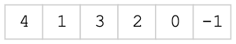
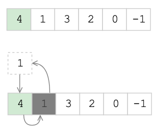
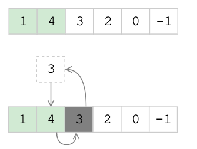
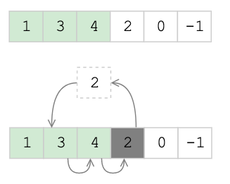
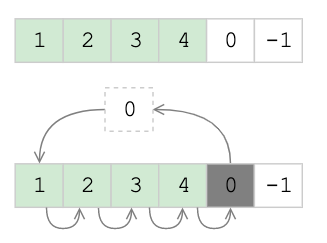
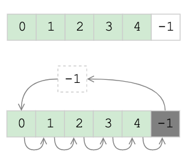
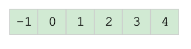

# Insertion Sort

[CS50: Insertion Sort](https://www.youtube.com/watch?v=dAAkElskMmU)

## Алгоритм 

1. Объявляем первый элемент списка отсортированным
2. Проверяем следующие элементы относительно него:
    - Если меньше, переставляем это элемент перед "первым"
    - Делаем сдвиг всех остальных на 1 вперед

Этот алгоритм эффективен когда в списке есть уже какая то отсортированная последовательность

## Сложность
- Асимптотическая сложность в лучшем случае O(n)
- Асимптотическая сложность в худшем случае O(n^2)
- Пространственная сложность: O(1)

## Визуализация

1. Возмем не отсортированный массив

   
   
2. Выбираем первое число, как отсортированную последовательность
    
   
   
3. Сравниваем следующий элемент с выбраным нами "отсортированным" элементом, 
   если он меньше, переставляем меньший на место отсортированого. 
   Сдвигаем отсортированную часть массива на 1 вперед

   
   
4. Сравниваем следующий элемент с выбраным нами "отсортированным" элементом, 
   если он меньше, переставляем меньший в отсортированную часть массива. 
   *При этом, он должен расположится в соответствующем месте, т.е. по порядку.*
   Сдвигаем отсортированную часть массива на 1 вперед

   
   
5. Сравниваем следующий элемент с выбраным нами "отсортированным" элементом, 
   если он меньше, переставляем меньший в отсортированную часть массива.
   *При этом, он должен расположится в соответствующем месте, т.е. по порядку.*
   Сдвигаем отсортированную часть массива на 1 вперед

   
   
6. Сравниваем следующий элемент с выбраным нами "отсортированным" элементом, 
   если он меньше, переставляем меньший в отсортированную часть массива.
    *При этом, он должен расположится в соответствующем месте, т.е. по порядку.*
  Сдвигаем отсортированную часть массива на 1 вперед

   

7. Сравниваем следующий элемент с выбраным нами "отсортированным" элементом, 
   если он больше, проходим дальше.
   

8. Сравниваем следующий элемент с выбраным нами "отсортированным" элементом, 
   если он больше, проходим дальше.
   
   
7. Масив отсортирован

   
   
   
