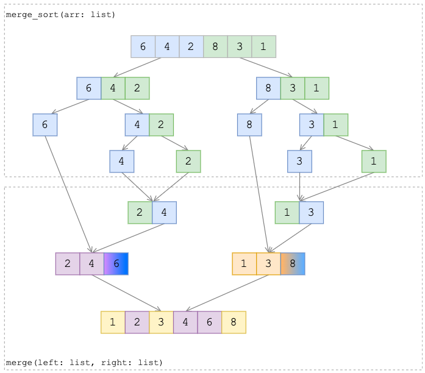

# Сортировка слиянием

Алгоритм принадлежит группе: Разделяй и влавствуй

- Асимптотическая сложность O(n * log n)
- Пространственная сложность O(n) - где n размер нового массив под отсортированные данные

## Алгоритм

На каждом шаге:
- Массив разбивают на две части примерно равного размера. 
  Рекурсивно вызываю функцию `merge_sort(), 
  пока не получим массив из одного элемента
- После сливаем два массива (и там же сортируем) в третий, 
  используя вспомогательную функцию `merge()`.
  Т.е. два упорядоченых массива  соеденяют в один

## Визуализация

## Дополнительные материалы
- [https://foxford.ru/wiki/informatika/sortirovka-sliyaniem](https://foxford.ru/wiki/informatika/sortirovka-sliyaniem)