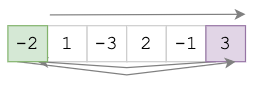
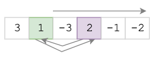
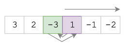
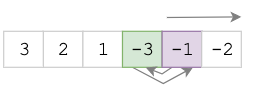

# Select Sort

## Алгоритм

- Берем первый элемент, записваем в переменную `max_elem`
- Во вложенном цикле сравниваем его со всеми остальными элементами, до конца списка, 
  если встречаем `arr[j]` > `max_elem` записываем его в `max_elem`, устанавливаем переменную `need_replace=True`
- Если число больше текущего было найдено (выставлен флаг: `need_replace=True`) текущий элемент и максимальный местами

1. Выбираем max_elem = -2.
    - Проверяем весь список, ищем максимальный элемент, записываем его в max_elem = 3
    - Меняем местами -2 и 3
    - переходим на следующий элемент
    
    

2. Выбираем `max_elem = 1`.
    - Проверяем весь список, ищем элемент больше `max_elem = 1`, записываем его в `max_elem = 2`
    - Меняем местами 1 и 2
    - переходим на следующий элемент
    
    

3. Выбираем `max_elem = -3`.
    - Проверяем весь список, ищем элемент больше `max_elem = -3`, записываем его в `max_elem = 1`
    - Меняем местами -3 и 2
    - переходим на следующий элемент
    
    

4. Выбираем `max_elem = -3`.
    - Проверяем весь список, ищем элемент больше `max_elem = -3`, записываем его в `max_elem = -1`
    - Меняем местами -3 и -1
    - переходим на следующий элемент
    
    
    
5. Выбираем `max_elem = -3`.
    - Проверяем весь список, ищем элемент больше `max_elem = -3`, записываем его в `max_elem = -2`
    - Меняем местами -3 и -2
    - переходим на следующий элемент
    
    
    
Список отсортирован